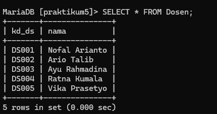
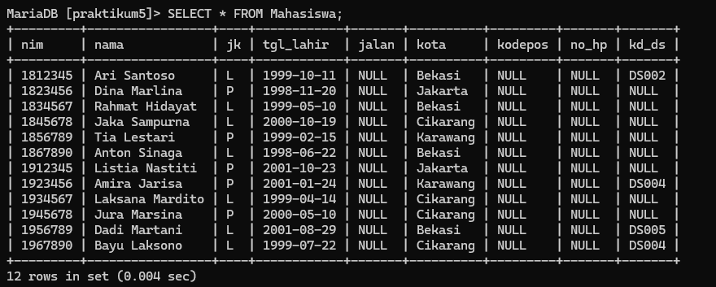
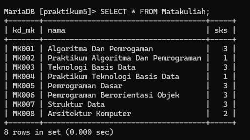
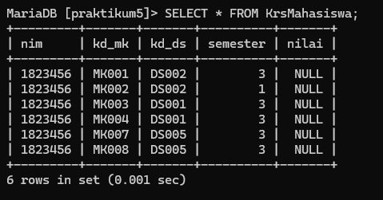
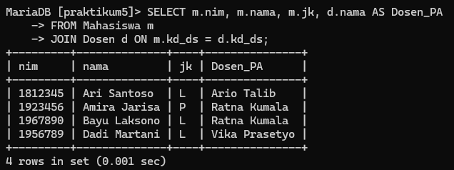
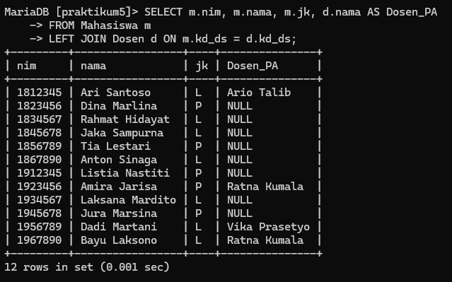
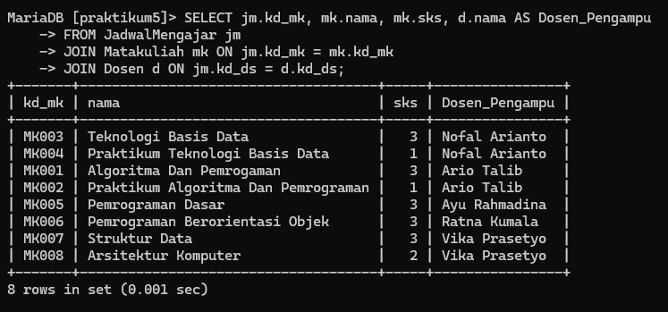
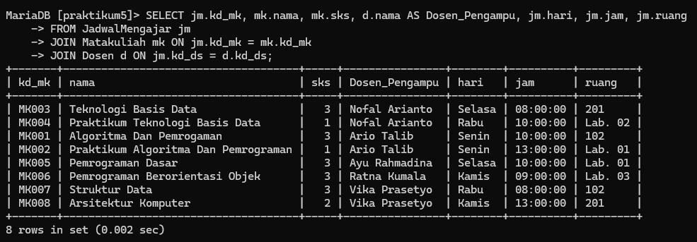

# Tugas Praktikum 5 { Pertemuan ke 12 }


| **Nama**            | **NIM**   | **Kelas** | **Matkul** |
| ------------------- | --------- | --------- | ---------- |
| Ahmad Ridho Septian | 312310447 | TI.23.A5  | Basis Data |

# Soal Latihan Praktikum


## Latihan

- Lakukan JOIN table Mahasiswa dan Dosen.
- Lakukan JOIN tabel Matakuliah dan Dosen.
- Lakukan JOIN table JadwalMengajar, Dosen, dan Matakuliah.
- Lakukan JOIN tabel KrsMahasiswa, Mahasiswa, Matakuliah, dan Dosen.

## Buat Script SQL JOIN Table berdasarkan skema data diatas.

```
CREATE TABLE Dosen(
    kd_ds VARCHAR(50) NOT NULL PRIMARY KEY,
    nama VARCHAR(100) NOT NULL
);

INSERT INTO Dosen (kd_ds, nama) VALUES
    ('DS001', 'Nofal Arianto'),
    ('DS002', 'Ario Talib'),
    ('DS003', 'Ayu Rahmadina'),
    ('DS004', 'Ratna Kumala'),
    ('DS005', 'Vika Prasetyo');

SELECT * FROM Dosen;
```

Output :



```
INSERT INTO Mahasiswa (nim, nama, jk, tgl_lahir, jalan, Kota, kodepos, no_hp, kd_ds) VALUES
    ('1812345', 'Ari Santoso', 'L', '1999-10-11', 'Jl. Bekasi', 'Bekasi', '17114', '081234567890', 'DS002'),
    ('1823456', 'Dina Marlina', 'P', '1998-11-20', 'Jl. Jakarta', 'Jakarta', '12110', '081234567891', NULL),
    ('1834567', 'Rahmat Hidayat', 'L', '1999-05-10', 'Jl. Bekasi', 'Bekasi', '17114', '081234567892', NULL),
    ('1845678', 'Jaka Sampurna', 'L', '2000-10-19', 'Jl. Cikarang', 'Cikarang', '17530', '081234567893', NULL),
    ('1856789', 'Tia Lestari', 'P', '1999-02-15', 'Jl. Karawang', 'Karawang', '41361', '081234567894', NULL),
    ('1867890', 'Anton Sinaga', 'L', '1998-06-22', 'Jl. Bekasi', 'Bekasi', '17114', '081234567895', NULL),
    ('1912345', 'Listia Nastiti', 'P', '2001-10-23', 'Jl. Jakarta', 'Jakarta', '12110', '081234567896', NULL),
    ('1923456', 'Amira Jarisa', 'P', '2001-01-24', 'Jl. Karawang', 'Karawang', '41361', '081234567897', 'DS004'),
    ('1934567', 'Laksana Mardito', 'L', '1999-04-14', 'Jl. Cikarang', 'Cikarang', '17530', '081234567898', NULL),
    ('1945678', 'Jura Marsina', 'P', '2000-05-10', 'Jl. Cikarang', 'Cikarang', '17530', '081234567899', NULL),
    ('1956789', 'Dadi Martani', 'L', '2001-08-29', 'Jl. Bekasi', 'Bekasi', '17114', '081234567900', 'DS005'),
    ('1967890', 'Bayu Laksono', 'L', '1999-07-22', 'Jl. Cikarang', 'Cikarang', '17530', '081234567901', 'DS004');

SELECT * FROM Mahasiswa;
```

Output :



```
CREATE TABLE Matakuliah(
    kd_mk VARCHAR(50) NOT NULL PRIMARY KEY,
    nama VARCHAR(100) NOT NULL,
    sks INT
);

INSERT INTO Matakuliah (kd_mk, nama, sks) VALUES
    ('MK001', 'Algoritma Dan Pemrograman', 3),
    ('MK002', 'Praktikum Algoritma Dan Pemrograman', 1),
    ('MK003', 'Teknologi Basis Data', 3),
    ('MK004', 'Praktikum Teknologi Basis Data', 1),
    ('MK005', 'Pemrograman Dasar', 3),
    ('MK006', 'Pemrograman Berorientasi Objek', 3),
    ('MK007', 'Struktur Data', 3),
    ('MK008', 'Arsitektur Komputer', 2);

SELECT * FROM Matakuliah;
```

Output :



```
CREATE TABLE JadwalMengajar(
    kd_mk VARCHAR(50) NOT NULL,
    kd_ds VARCHAR(50) NOT NULL,
    hari ENUM('Senin', 'Selasa', 'Rabu', 'Kamis'),
    jam TIME NOT NULL,
    ruang VARCHAR(50),
    PRIMARY KEY(kd_mk, kd_ds),
    FOREIGN KEY(kd_mk) REFERENCES Matakuliah(kd_mk),
    FOREIGN KEY(kd_ds) REFERENCES Dosen(kd_ds)
);

INSERT INTO JadwalMengajar (kd_mk, kd_ds, hari, jam, ruang) VALUES
    ('MK001', 'DS002', 'Senin', '10:00:00', '102'),
    ('MK002', 'DS002', 'Senin', '13:00:00', 'Lab. 01'),
    ('MK003', 'DS001', 'Selasa', '08:00:00', '201'),
    ('MK004', 'DS001', 'Rabu', '10:00:00', 'Lab. 02'),
    ('MK005', 'DS003', 'Selasa', '10:00:00', 'Lab. 01'),
    ('MK006', 'DS004', 'Kamis', '09:00:00', 'Lab. 03'),
    ('MK007', 'DS005', 'Rabu', '08:00:00', '102'),
    ('MK008', 'DS005', 'Kamis', '13:00:00', '201');

SELECT * FROM JadwalMengajar;
```

Output :



```
CREATE TABLE KRSMahasiswa(
    nim VARCHAR(50) NOT NULL,
    kd_mk VARCHAR(50) NOT NULL,
    kd_ds VARCHAR(50) NOT NULL,
    semester INT NOT NULL,
    nilai VARCHAR(50) DEFAULT NULL,
    PRIMARY KEY(nim, kd_mk, kd_ds),
    FOREIGN KEY(nim) REFERENCES Mahasiswa(nim),
    FOREIGN KEY(kd_mk) REFERENCES Matakuliah(kd_mk),
    FOREIGN KEY(kd_ds) REFERENCES Dosen(kd_ds)
);

INSERT INTO KRSMahasiswa (nim, kd_mk, kd_ds, semester) VALUES
    ('1823456', 'MK001', 'DS002', 3),
    ('1823456', 'MK002', 'DS002', 1),
    ('1823456', 'MK003', 'DS001', 3),
    ('1823456', 'MK004', 'DS001', 3),
    ('1823456', 'MK007', 'DS005', 3),
    ('1823456', 'MK008', 'DS005', 3);

SELECT * FROM KRSMahasiswa;
```

Output :


# Latihan

### JOIN table Mahasiswa dan Dosen

```
SELECT m.nim, m.nama, m.jk, d.nama AS Dosen_PA
FROM Mahasiswa m
JOIN Dosen d ON m.kd_ds = d.kd_ds;
```

#### Output :



### LEFT JOIN table Mahasiswa dan Dosen

```
SELECT m.nim, m.nama, m.jk, d.nama AS Dosen_PA
FROM Mahasiswa m
LEFT JOIN Dosen d ON m.kd_ds = d.kd_ds;
```

#### Output:



### JOIN table JadwalMengajar, Dosen, dan Matakuliah

```
SELECT jm.kd_mk, mk.nama, mk.sks, d.nama AS Dosen_Pengampu
FROM JadwalMengajar jm
JOIN Matakuliah mk ON jm.kd_mk = mk.kd_mk
JOIN Dosen d ON jm.kd_ds = d.kd_ds;
```

#### Output:



### JOIN table JadwalMengajar, Dosen, dan Matakuliah

```
SELECT jm.kd_mk, mk.nama, mk.sks, d.nama AS Dosen_Pengampu, jm.hari, jm.jam, jm.ruang
FROM JadwalMengajar jm
JOIN Matakuliah mk ON jm.kd_mk = mk.kd_mk
JOIN Dosen d ON jm.kd_ds = d.kd_ds;
```

#### Output :



### JOIN tabel KRSMahasiswa, Mahasiswa, Matakuliah, dan Dosen

```
select mahasiswa.nim, mahasiswa.nama, DosenPA. nama AS 'Dosen PA', Matakuliah.nama AS 'Mata Kuliah', Matakuliah.sks, DosenMK.nama AS 'Dosen Pengampu'
FROM KRSMahasiswa 
LEFT JOIN Mahasiswa ON mahasiswa.nim = KRSMahasiswa.nim
LEFT JOIN Dosen AS DosenPA ON DosenPA.kd_ds = Mahasiswa.kd_ds
LEFT JOIN Jadwalmengajar ON Jadwalmengajar.kd_mk = KRSMahasiswa.kd_mk
LEFT JOIN Dosen AS DosenMK ON DosenMK.kd_ds = Jadwalmengajar.kd_ds
LEFT JOIN Matakuliah ON Matakuliah.kd_mk Jadwalmengajar.kd_mk
;
```

#### Output :

.jpg>)

## FINISH.
